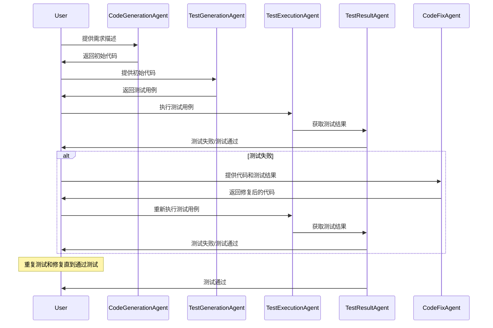

# AutoCodeGenTestFix

## 项目简介

`AutoCodeGenTestFix` 是一个基于大模型的自动代码生成、测试和修复工具。该项目旨在通过自动化流程，帮助开发者快速生成代码、编写测试用例、执行测试并修复代码，从而提高开发效率和代码质量。

## 项目架构

项目基于以下几个主要组件：

- **CodeGenerationAgent**：生成初始代码。
- **TestGenerationAgent**：生成相应的单元测试用例。
- **TestExecutionAgent**：执行测试用例并获取测试结果。
- **TestResultAgent**：分析测试结果。
- **CodeFixAgent**：根据测试结果修复代码。

以下是项目的架构图：

```plaintext
+----------------------+      +----------------------+      +----------------------+      +----------------------+      +----------------------+
|                      |      |                      |      |                      |      |                      |      |                      |
| CodeGenerationAgent  | ---> | TestGenerationAgent  | ---> | TestExecutionAgent   | ---> |  TestResultAgent     | ---> |    CodeFixAgent      |
|                      |      |                      |      |                      |      |                      |      |                      |
+----------------------+      +----------------------+      +----------------------+      +----------------------+      +----------------------+
```

执行流程如下：



## 使用方式

### 1. 安装必要的库

首先，确保安装好必要的库：
```bash
pip install langchain langchain_openai  pytest
```

### 2. 设置 OpenAI API 密钥

将你的 OpenAI API 密钥设置为环境变量，或在代码中直接设置：
```python
import openai
openai.api_key = 'your-openai-api-key'  # 替换为你的 OpenAI API 密钥
```

### 4. 示例

以下是一个简单的示例，展示如何使用 `AutoCodeGenTestFix` 解决 LeetCode 上的最长公共子串问题：

```shell
python main.py "实现一个函数，输入两个字符串 s1 和 s2，返回它们的最长公共子串的长度。"
```

### TODO

- 增加对其他模型的支持

### 贡献指南

如果你有兴趣为 `AutoCodeGenTestFix` 做出贡献，请按照以下步骤操作：

1. Fork 这个仓库。
2. 创建一个新的分支 (`git checkout -b feature-branch`)。
3. 提交你的修改 (`git commit -am 'Add some feature'`)。
4. 推送到分支 (`git push origin feature-branch`)。
5. 创建一个新的 Pull Request。

我们欢迎所有形式的贡献，包括但不限于：报告问题、修复 bug、添加新功能、改进文档等。

### 许可证

该项目基于 MIT 许可证进行分发。详细信息请参见 `LICENSE` 文件。